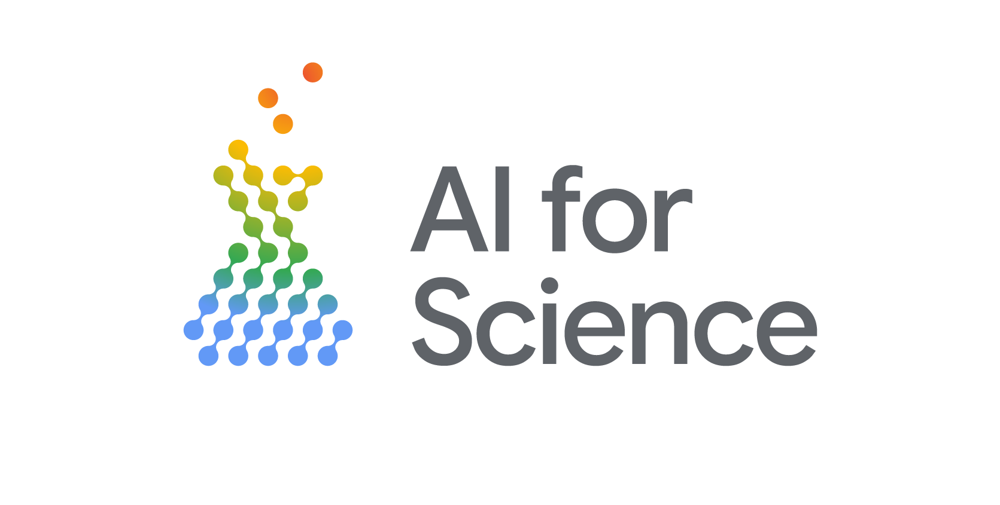

Master your AI journey with this 4-part workshop series designed for researchers and academics wanting to Build with AI. Throughout the series, attendees will learn foundational Python and data analysis skills, build Retrieval-Augmented Generation (RAG) pipelines to query custom knowledge bases, develop intelligent AI agents equipped with custom tools, and explore how to accelerate computational research using Google's Antigravity AI-assisted IDE.

## Register

Register for the series at the [GDG AI for Science](https://gdg.community.dev/events/details/google-gdg-ai-for-science-australia-presents-build-with-ai-python-and-ai-fundamentals/)

This workshop is part of the [GDG AI for Science](https://gdg.community.dev/events/details/google-gdg-ai-for-science-india-presents-googles-antigravity-accelerating-research-and-scientific-pipelines) workshop series. Join the community (in [Australia](https://gdg.community.dev/gdg-ai-for-science-australia/), [Korea](https://gdg.community.dev/gdg-ai-for-science-korea/), [Japan](https://gdg.community.dev/gdg-ai-for-science-japan), or [India](https://gdg.community.dev/gdg-ai-for-science-india/)) for talks, events, collaborations and more.

## When 
Every Thursday in May:

* May 7: [Python and AI fundamentals](https://gdg.community.dev/events/details/google-gdg-ai-for-science-australia-presents-build-with-ai-python-and-ai-fundamentals/)
* May 14: [Tailoring LLMs: RAG and Fine-Tuning](https://gdg.community.dev/events/details/google-gdg-ai-for-science-australia-presents-build-with-ai-tailoring-llms-rag-and-fine-tuning/)
* May 21: [AI Agents for Research](https://gdg.community.dev/events/details/google-gdg-ai-for-science-australia-presents-build-with-ai-ai-agents-for-research/)
* May 28: [AI-Assisted Research with Antigravity](https://gdg.community.dev/events/details/google-gdg-ai-for-science-australia-presents-build-with-ai-ai-assisted-research-with-antigravity/)

## Target Audience

This workshop sereis is aimed at anyone looking to accelerate their research with AI including:

* Research students (undergrad, masters, PhD, etc)
* Researchers requiring AI tools
* Data Scientists and professionals supporting scientific projects

Use cases will be grounded in typical scientific workloads. 

## Requirements:

* A Google account to use Google Colab.
* Basic familiarlity with Python (or join us for session on May 7 to get everything you need). 
* **Bonus** - free cloud credits for every attendee!

As our speakers are donating their time, we want to ensure a full and engaged event. Please reserve your spot only if you are committed to joining us for this workshop.

## Recording

Will be available after the event.